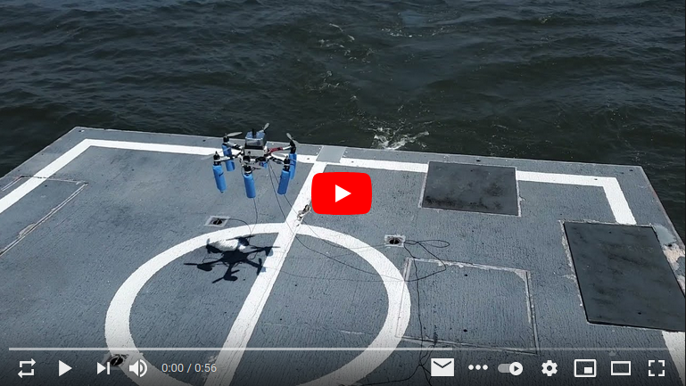
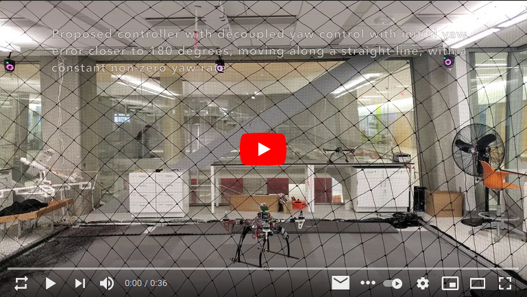
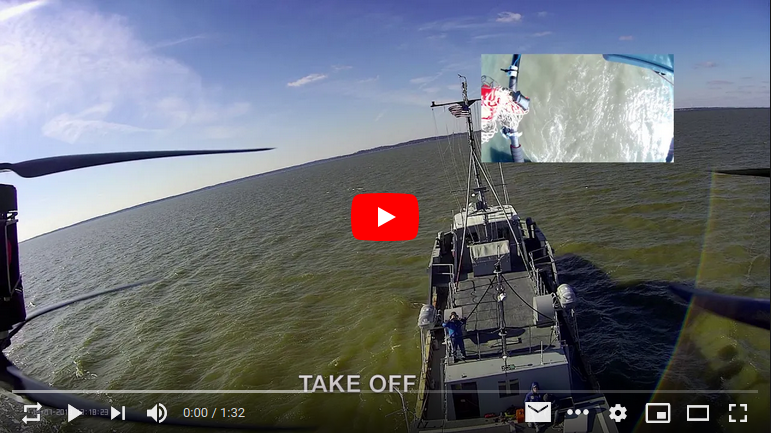
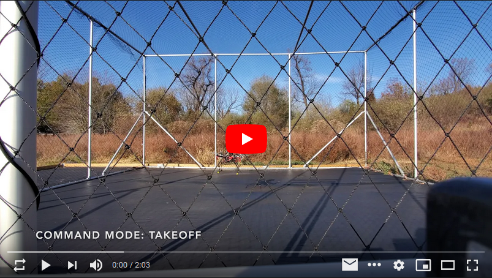

### Hi there 👋
- 💼 I work as a Sensor Fusion and Navigation Engineer at [Kearfott](https://www.kearfott.com/)
- 💼 My previous experiences include working as Robotics and Control Engineer at [@American-Robotics](https://github.com/American-Robotics).
- 🎓 I earned my PhD at [@fdcl-gwu](https://github.com/fdcl-gwu).
- 🔬 My research:
    - Developing geometric controllers and estimators for UAVs
    - Ship air-wake measurements with airborne sensors
    - Shipboard UAV landing
- 📫 You can reach me at kanishkegb@gwu.edu
- 💬 Or at:

  

   

### 🛠️ I am familiar with

   

### 🎥 A few cool videos of my work

You can find more at [🔗 kanishkegb.github.io](https://kanishkegb.github.io/)

   

### ✨ Open-source work
I try my best to open-source my work. 
You can find a sneak-peak below.

<!--  -->
